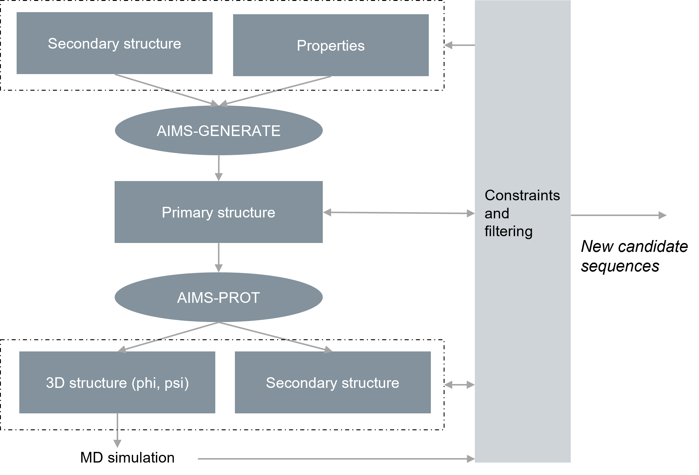

# AI-empowered material scientist (AIMS)

This github repository provides data and code examples for the AIMS system described in  
"Accelerated Engineering of ELP-based materials through Hybrid Biomimetic-De Novo predictive molecular design" []

This repository is organized as follows:

    * data
      - the directory contain raw input data for machine-learning models AIMS-GENERATE and AIMS-PROT.
    
    * models
      - The pre-trained machine-learning models:
        - aims_gen_model.h5
        - aims_prot_model.h5 

    * results
      - the results files of different steps of new sequence generation
      - Heatmaps, venn diagrams, and property plots of the results are in the subdirectory "plots".

    * aims
      - Directory for source Python scripts:
        - aims_*.py, gen_*.py
        - Visualizing and plotting the results:  plot_*.py

    * run_examples.py
      - Python script to run the examples

    * requirements.txt
      - the required Python libraries and their versions

    * LICENSE


### Run the examples

To run the examples you need a working Python environment (Python 3.11) and 
the required Python libraries (see `requirements.txt`) installed. 

``` 
python -m pip install -r requirements.txt 
```

Then, the script `run_examples.py` is used to run the example code to generate new sequences.
```
python run_examples.py
```
All the results are stored into the directory `results`, which include:

* new_gen_sequences.txt
  - the candidate sequences after initial generation step.
* new_sequences_alphahelix90.txt
  - the sequences after applying secondary structure Alpha-Helix proportion threshold check
* new_sequences_helices_propensity.txt
  - the remaining sequence candidates after helix propensity threshold check
* RMSD_less_than_3A.csv 
  - Valid candidate sequences after the separate MD simulation check (see the article about the MD simulation performed)
* new_sequences.txt
  - the final resulting 144 sequence candidates
* new_sequences_with_properties.csv
  - a csv file containing the final sequence candidates with their computed seven property (...) values
* plots
  - Note: to create "plots", assign the variable "create_plots" to value "True" in `run_examples.py`.
  - The subdirectory "plots" contains heatmaps, venn diagrams (see subdirectory `venn3`) and property value
  plots (subdirectory `properties`) of the candidate sequences (see new_sequences.txt) to support expert evaluation and selection of 
  sequences for further laboratory tests (see the article).


 

*Figure: Generating new candidate sequences*

